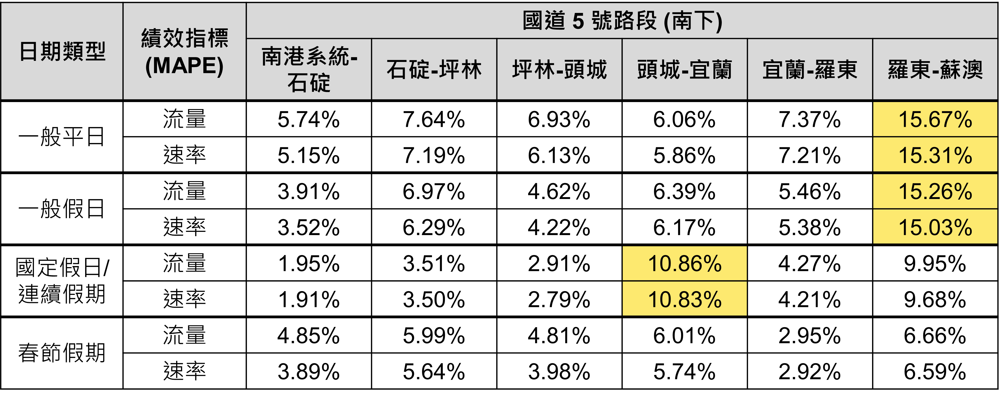
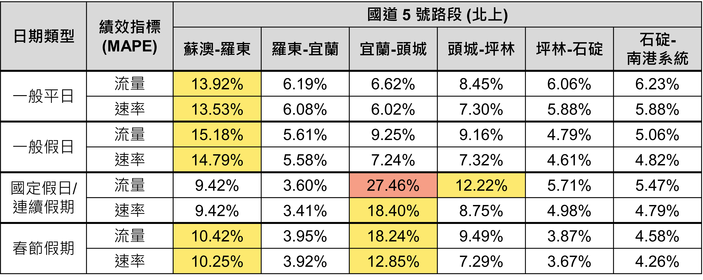
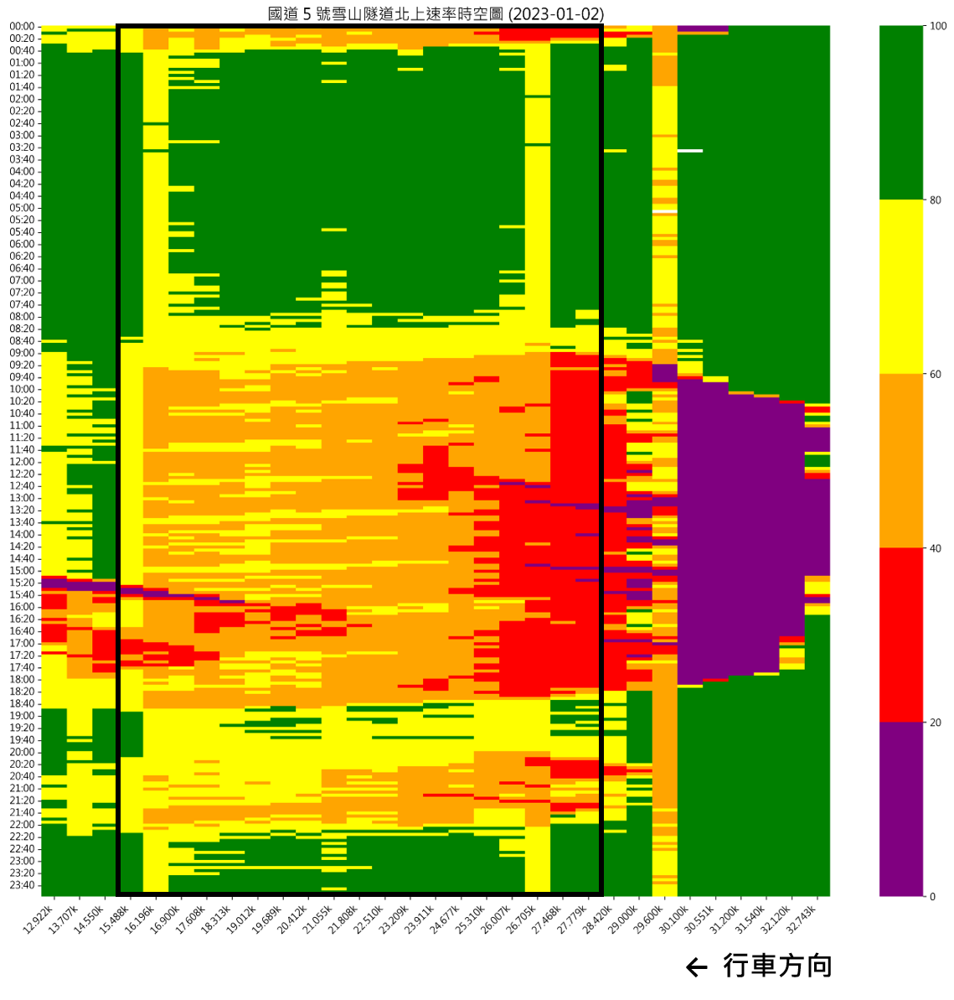
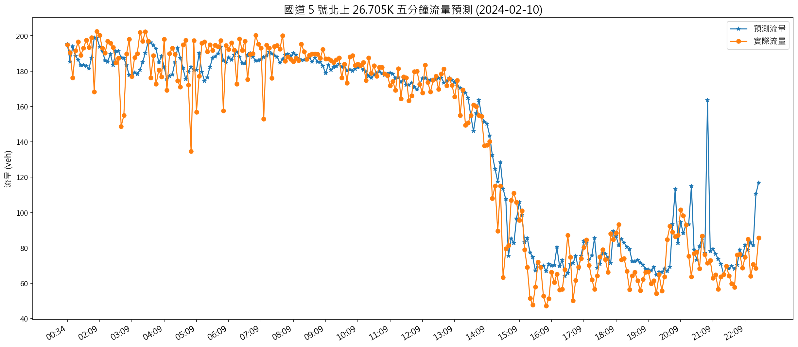
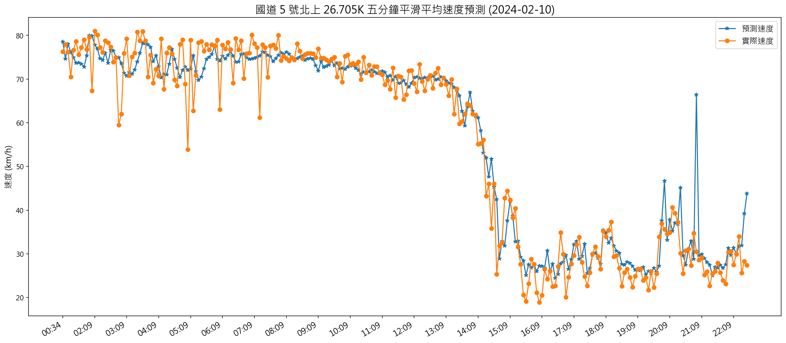

# Time-Series Forecasting on Highway Traffic Volume and Speed (I)
###### Tech Stack: `Time-Series Forecasting` `CNN` `Python` `PyTorch` `MySQL`

## Introduction
This project is expected to be a long-term project, and this repository shows the achievement in Stage I. In Stage I, we succeeded in building a deep learning model that can estimate the traffic volume and speed on highways precisely in the short term.

## Research Scope
Both northbound and southbound traffic data on Freeway No.5 in 2023. 

## Methodology
We adopted the __Convolutional Neural Network (CNN) architecture__ to include the spatial dependence and the time-series characteristic. We have not only collected the time-series traffic data of the target vehicle detector but also the data of the upstream and the downstream vehicle detector relative to the target vehicle detector.

In this project, we chose five features, respectively were:
- Time-Series __traffic volume__ data aggregated in summation in 5 minutes for the past 30 minutes
- Time-Series __traffic speed__ data aggregated on average in 5 minutes for the past 30 minutes
- Time-Series __traffic occupancy__ data aggregated on average in 5 minutes for the past 30 minutes
- __The number of lanes__ detected for each vehicle detectors
- __The characteristics of the road section__ for each vehicle detectors

These five features served as a channel respectively, then stacked them all as an input of the CNN. There was composed of a $3 \times 6$ tensor for each channel.

This figure shows the workflow of this project. We built the data pipeline to crawl the traffic data from [tisvcloud.freeway.gov.tw](https://tisvcloud.freeway.gov.tw/), then stored them in the local MySQL database. After that, we queried data from the MySQL database and used Python to transform them into 3-D dimensional tensors, and saved them in `.h5` format. In the training process, we loaded these data through the PyTorch `Dataloader` and put them into the CNN regression model built by the PyTorch framework.

## Results
There were about 8.96 million data in total, 80% were used for training (around 6.89 million) and the remaining data were used for validation (around 1.72 million). As you can see in the `validation.ipynb`, <u>__the MAPE of the volume and speed estimated values are 6.93% and 7.86%__</u>, indicating the model possesses a strong ability to predict short-term traffic.

## Validation Results in Each Road Section
### Southbound

### Northbound

## Validation Results on the Lunar New Year 2024
### Heatmap Analysis
Let's focus on the section of Hsuehshan Tunnel (雪山隧道), i.e., we concentrate on the data <u>__between 15.488K and 27.779K.__</u> As you can see in the heatmap, __26.705K is the bottleneck__ of the northbound section of Hsuehshan Tunnel (雪山隧道).
  

Then, let's visualize the prediction results of our CNN model. According to the heatmap shown in the previous section, we collected the vehicle detector data on 26.705K of the northbound of Freeway No.5. As you can see in the figures, our model can capture the time series patterns and closely fit the real-world detected traffic flow values.

### Volume Prediction on 2024-02-10

### Speed Prediction on 2024-02-10

<!-- ## Expected Future Work
- In Stage II, we plan to develop a long-term traffic prediction model (expected to be able to predict at least for the next 4 hours), and it is expected to be able to be generalized to other highways.
- In Stage III, we plan to develop a front-end interface for users that can be visualized on a web page, aiming to provide road users with advanced information before departure. -->